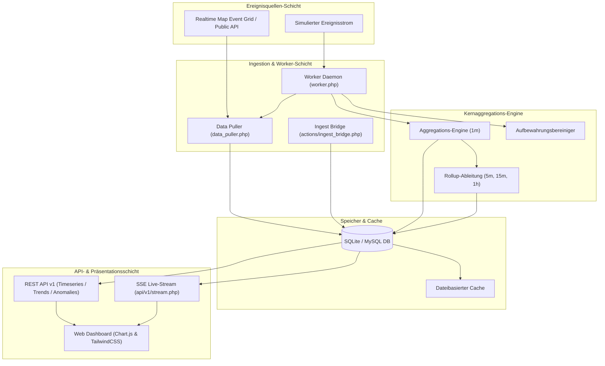

# Temporal Memory Grid (TMG)

<p align="center">
  <a href="README.md">🇬🇧 <b>English</b></a> |
  <a href="README.tr.md">🇹🇷 <b>Türkçe</b></a> |
  <a href="README.de.md">🇩🇪 <b>Deutsch</b></a> |
  <a href="README.es.md">🇪🇸 <b>Español</b></a> |
  <a href="README.fr.md">🇫🇷 <b>Français</b></a>
</p>

<p align="center">
  
  
  
  
  
  
</p>

**Temporal Memory Grid (TMG)** ist eine hochleistungsfähige, leichtgewichtige Zeitreihen-Ereignisverarbeitungs-, Bucketing-, Aggregations-, Trendvergleichs- und Anomalieerkennungsplattform, die mit PHP 8, SQLite/MySQL, TailwindCSS und Chart.js entwickelt wurde.

Sie lässt sich nahtlos an Echtzeit-Geodaten- oder Ereignis-Feeds anbinden (wie *Realtime Map Event Grid*), aggregiert hochfrequente Rohereignisse in mehrstufige Zeitintervalle (`1m`, `5m`, `15m`, `1h`, `1d`), erkennt Anomalien, berechnet Zwei-Perioden-Trends und stellt interaktive Diagramme mit Echtzeit-SSE-Streaming bereit.

---

## 📑 Inhaltsverzeichnis
- [Architektur](#-architektur)
- [Hauptfunktionen](#-hauptfunktionen)
- [Schnellstart](#-schnellstart)
- [Hintergrund-Worker & Automatisierung](#-hintergrund-worker--automatisierung)
- [Echtzeit-Streaming (SSE)](#-echtzeit-streaming-sse)
- [REST-API-Referenz](#-rest-api-referenz)
- [Verzeichnisstruktur](#-verzeichnisstruktur)
- [Sicherheit & Authentifizierung](#-sicherheit--authentifizierung)
- [Lizenz & Autoren](#-lizenz--autoren)

---

## 🏛 Architektur



---

## ✨ Hauptfunktionen

1. **Zeitreihen-Bucketing & Aggregations-Engine**
   - Automatische Aggregation von Rohereignissen in Intervalle von `1m`, `5m`, `15m`, `1h`, `1d`.
   - Berechnet Metriken: `total_events`, `events_by_type`, `events_by_source` und `events_by_geo_region`.
   - Generiert Rollups auf höherer Ebene für ultraschnelle Analysen.

2. **Interaktives Zeitreihen-Dashboard**
   - Reaktionsschnelle Linien- und Balkendiagramme über Chart.js.
   - Filterung nach Zeiträumen (Heute, Letzte 24 Std., Letzte 7 Tage, Benutzerdefiniert), Bucket-Größe und Ereignistyp.

3. **Zwei-Perioden-Trendvergleich**
   - Vergleichen Sie Haupt- und Vergleichsperioden mit visuellen Balkendiagrammen und prozentualen Raten.

4. **Anomalieerkennung**
   - Erkennt Abweichungen basierend auf **Historischem Durchschnitt** oder **Gleitendem Durchschnitt (MA)**.

5. **Automatisierter Hintergrund-Worker**
   - Standalone-CLI-Daemon oder Cronjob-Modus (`--once`).

6. **Echtzeit-Streaming (SSE)**
   - Server-Sent Events für sofortige grafische Updates ohne Neuladen der Seite.

7. **Dynamische Authentifizierung & API-Schlüssel**
   - Bcrypt-Passwort-Hashing (`password_verify`) und vollständige Schlüsselverwaltung im Panel.

8. **Mehrsprachige Unterstützung (i18n)**
   - 5 Sprachen: 🇹🇷 Türkisch, 🇬🇧 Englisch, 🇩🇪 Deutsch, 🇪🇸 Spanisch, 🇫🇷 Französisch.

---

## 🚀 Schnellstart

```bash
# 1. Datenbank initialisieren
php setup_database_sqlite.php

# 2. Lokalen Server starten
php -S localhost:8000
```
- **Login-URL:** `http://localhost:8000/login.php` (Benutzer: `admin` / Passwort: `temporal123`)

---

## 📄 Lizenz & Autoren

- **Autor & Pflege:** **ADA Creative Co.** ([https://adacreative.co](https://adacreative.co))
- **Kontakt:** [git@adacreative.co](mailto:git@adacreative.co)
- **Lizenz:** Lizenziert unter der [Apache License 2.0](LICENSE).
