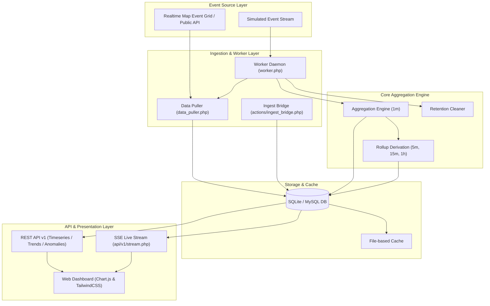

# Temporal Memory Grid (TMG)

<p align="center">
  
  
  
  
  
</p>

**Temporal Memory Grid (TMG)** is a high-performance, lightweight time-series event ingestion, temporal bucketing, aggregation, trend comparison, and anomaly detection platform built with PHP 8, SQLite/MySQL, TailwindCSS, and Chart.js.

It seamlessly connects to real-time geospatial/event streams (such as *Realtime Map Event Grid*), aggregates high-frequency raw events into multi-tier time buckets (`1m`, `5m`, `15m`, `1h`, `1d`), detects anomalies, computes two-period trends, and provides interactive charts and real-time live data streaming.

---

## 📑 Table of Contents
- [Architecture](#-architecture)
- [Key Features](#-key-features)
- [Quick Start](#-quick-start)
- [Background Worker & Automation](#-background-worker--automation)
- [Real-Time Streaming (SSE)](#-real-time-streaming-sse)
- [REST API Reference](#-rest-api-reference)
- [Directory Structure](#-directory-structure)
- [Security & Authentication](#-security--authentication)
- [License](#-license)

---

## 🏛 Architecture



---

## ✨ Key Features

1. **Temporal Bucketing & Aggregation Engine**
   - Automatically aggregates raw events into `1m`, `5m`, `15m`, `1h`, `1d` intervals.
   - Computes metrics: `total_events`, `events_by_type`, `events_by_source`, and `events_by_geo_region`.
   - Derives higher-level rollups on-the-fly for ultra-fast analytical queries.

2. **Interactive Time-Series Dashboard**
   - Responsive line and bar charts powered by Chart.js.
   - Filter by date ranges (Today, Last 24 Hours, Last 7 Days, Custom range), bucket size, event type, and source.
   - Summary cards displaying total events, peak bucket times, and average rates.

3. **Two-Period Trend Comparison**
   - Compare any primary period against a comparison period (e.g. this hour vs last hour).
   - Computes absolute event differences and percentage changes with visual comparison graphs.

4. **Anomaly Detection**
   - Detects abnormal spikes or drops using **Historical Average** or **Moving Average (MA)** window baselines.
   - Highlights anomalous buckets on the chart in red and presents tabular variance metrics.

5. **Automated Background Worker & Daemon**
   - Standalone CLI daemon with graceful shutdown, live heartbeat monitoring, and crontab mode (`--once`).
   - Automated periodic data ingestion, rollup synthesis, and daily retention cleanup.

6. **Real-Time Streaming (SSE)**
   - Built-in Server-Sent Events endpoint streaming live bucket counts and real-time statistics directly into the dashboard.

7. **Dynamic DB Authentication & API Keys**
   - Bcrypt-hashed user login (`password_verify`).
   - Dynamic API Key management in web UI (generate, revoke, rate limit, copy to clipboard).

---

## 🚀 Quick Start

### 1. Requirements
- **PHP 8.0+** with `pdo_sqlite` (or `pdo_mysql`), `curl`, and `json` extensions enabled.
- Web Server: Built-in PHP server, Apache, or Nginx.

### 2. Setup Database & Seeds
Run the automated SQLite migration and seed script:
```bash
php setup_database_sqlite.php
```
*Creates all tables (`users`, `api_keys`, `time_buckets`, `bucket_metrics`, `events`, `settings`) and seeds the default admin user and API keys.*

### 3. Start the Web Server
```bash
php -S localhost:8000
```

### 4. Access the Dashboard
- **URL:** `http://localhost:8000/login.php`
- **Default Username:** `admin`
- **Default Password:** `temporal123`

---

## ⚙️ Background Worker & Automation

The background worker continuously ingests external events, processes time buckets, derives rollups, and cleans expired data according to retention policies.

### Continuous Daemon Mode:
```bash
php worker.php --interval=10 --simulate
```
*Or on Windows, double-click [`scripts/run_worker.bat`](file:///g:/shovt/tam%20olarak%20bitmeyenler/TEMPORAL%20MEMORY%20GRID/TEMPORAL%20MEMORY%20GRID/scripts/run_worker.bat).*

### Single Run / Crontab Mode:
```bash
php worker.php --once --simulate
```
Add to Linux crontab (`crontab -e`):
```bash
* * * * * /usr/bin/php /path/to/project/worker.php --once >> /var/log/tmg_worker.log 2>&1
```

---

## 📡 Real-Time Streaming (SSE)

Connect to the live Server-Sent Events stream using JavaScript:

```javascript
const eventSource = new EventSource('/api/v1/stream.php?api_key=temporal_grid_api_key_2024&bucket_size=1m');

eventSource.addEventListener('update', (event) => {
    const data = JSON.parse(event.data);
    console.log('Realtime Bucket Update:', data);
});
```

---

## 🔌 REST API Reference

All API requests require an API key passed via query parameter `?api_key=...` or HTTP Header `X-API-Key: ...`.

### Default API Keys:
- `temporal_grid_api_key_2024`
- `demo_key_12345`

| Endpoint | Method | Description |
| :--- | :---: | :--- |
| `/api/v1/timeseries.php` | `GET` | Get aggregated time-series buckets for specified metric and time range. |
| `/api/v1/trend.php` | `GET` | Compare metrics between two time windows (primary vs comparison). |
| `/api/v1/anomalies.php` | `GET` | Detect anomalies based on historical average or moving average deviation. |
| `/api/v1/stream.php` | `GET` | Live Server-Sent Events (SSE) stream for real-time dashboard updates. |
| `/api/v1/export.php` | `GET` | Export timeseries data in CSV or JSON format. |

#### Example Timeseries Query:
```bash
curl -X GET "http://localhost:8000/api/v1/timeseries.php?api_key=temporal_grid_api_key_2024&metric_type=total_events&bucket_size=1m&start_time=2026-08-22T00:00:00Z&end_time=2026-08-22T12:00:00Z"
```

**JSON Response:**
```json
{
  "success": true,
  "message": "Success",
  "data": {
    "metric_type": "total_events",
    "bucket_size": "1m",
    "start_time": "2026-08-22 00:00:00",
    "end_time": "2026-08-22 12:00:00",
    "buckets": [
      { "bucket_start": "2026-08-22 00:00:00", "count": 14 },
      { "bucket_start": "2026-08-22 00:01:00", "count": 8 }
    ]
  }
}
```

---

## 📁 Directory Structure

```
TEMPORAL MEMORY GRID/
├── actions/                     # AJAX & Backend Handler endpoints
│   ├── api_keys.php             # API Key management (CRUD)
│   ├── change_password.php      # Password update endpoint
│   ├── ingest_bridge.php        # JSON payload bridge & deduplication
│   ├── worker_status.php        # Worker health & heartbeat API
│   └── worker_control.php       # Manual worker trigger
├── api/v1/                      # REST API Endpoints
│   ├── timeseries.php           # Aggregated time buckets
│   ├── trend.php                # Two-period comparison
│   ├── anomalies.php            # Deviation & anomaly detector
│   ├── stream.php               # Server-Sent Events (SSE)
│   └── export.php               # CSV/JSON export
├── docs/                        # API & Architecture documentation
├── includes/                    # Header & Footer UI templates
├── postman/                     # Ready-to-import Postman collection
├── scripts/                     # Windows (.bat) and Linux (.sh) runners
├── aggregation_engine.php       # Core temporal bucketing engine
├── auth.php                     # Authentication & API Key validation
├── cache.php                    # File-based caching service
├── config.php                   # System configuration
├── config.sample.php            # Sample configuration for deployments
├── data_puller.php              # External feed fetcher & parser
├── derive_rollups.php           # Rollup synthesis (1m -> 5m -> 15m -> 1h)
├── index.php                    # Timeseries Dashboard UI
├── trends.php                   # Trend Comparison UI
├── anomalies.php                # Anomaly Detection UI
├── settings.php                 # System, Worker & API Key Settings UI
├── worker.php                   # Background Worker Daemon
└── setup_database_sqlite.php    # SQLite schema & seed migration
```

---

## 🔒 Security & Authentication

- **Web Panel:** Session-based authentication with Bcrypt password hashing (`PASSWORD_BCRYPT`).
- **REST API:** Authenticated via `api_keys` table with individual rate limits (default: 100 requests/minute/IP).
- **SQL Injection Prevention:** 100% Parameterized queries across SQLite and MySQL via PDO.
- **XSS Protection:** Output sanitization (`htmlspecialchars`) and input validation across all interfaces.

---

## 📄 License & Authors

- **Author & Maintainer:** **ADA Creative Co.** ([https://adacreative.co](https://adacreative.co))
- **Contact / Git:** [git@adacreative.co](mailto:git@adacreative.co)
- **License:** Licensed under the [Apache License 2.0](LICENSE).


