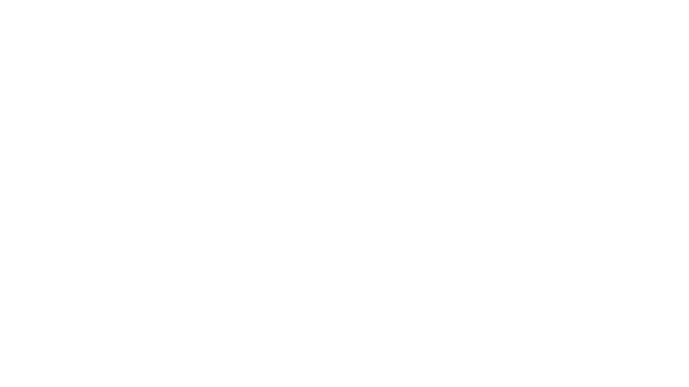
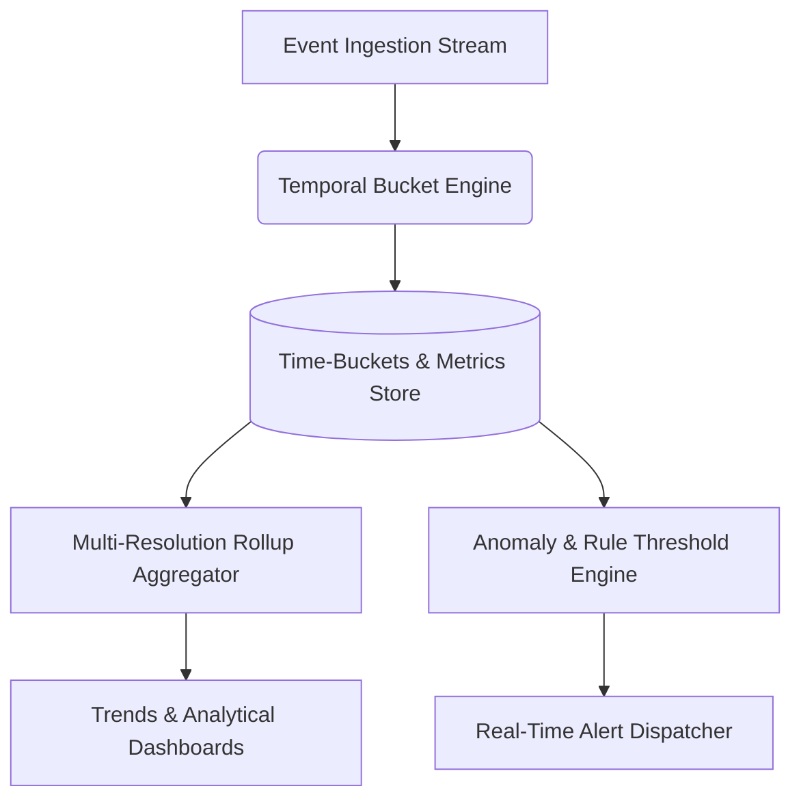
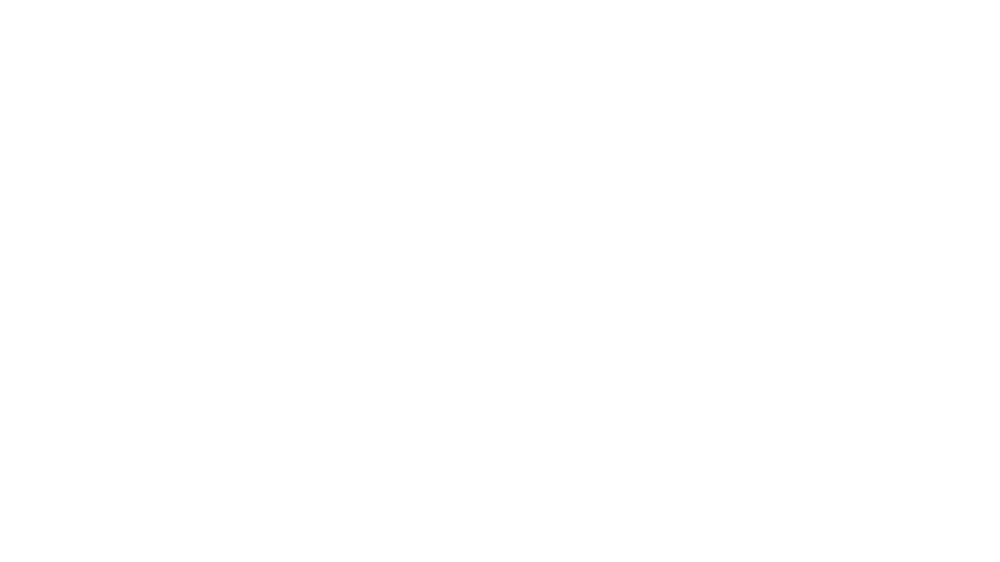
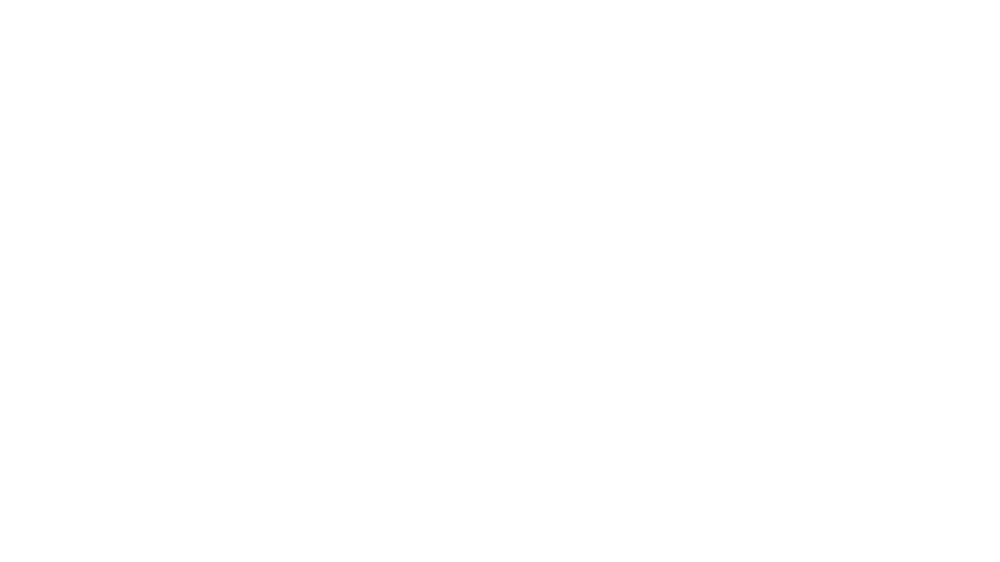
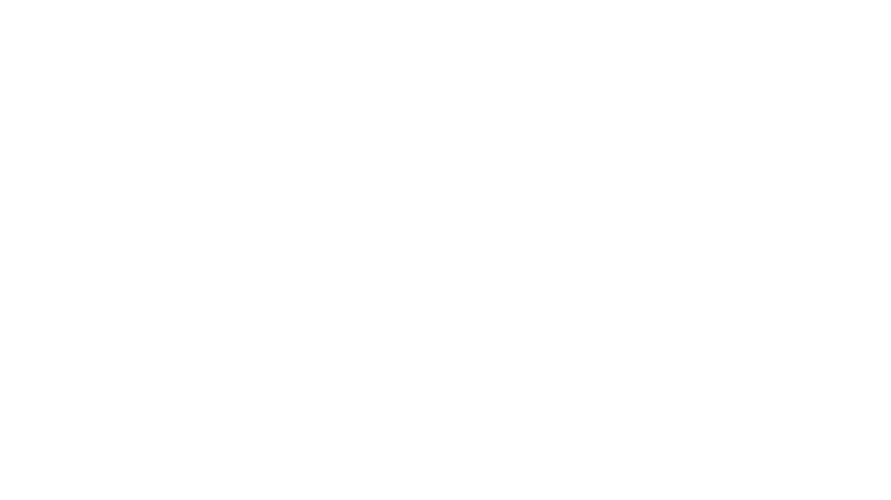
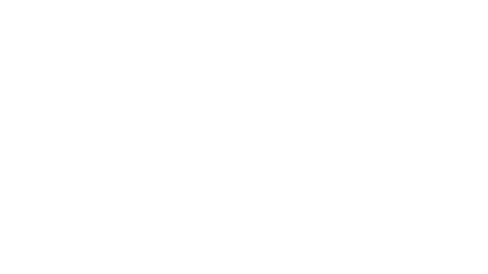
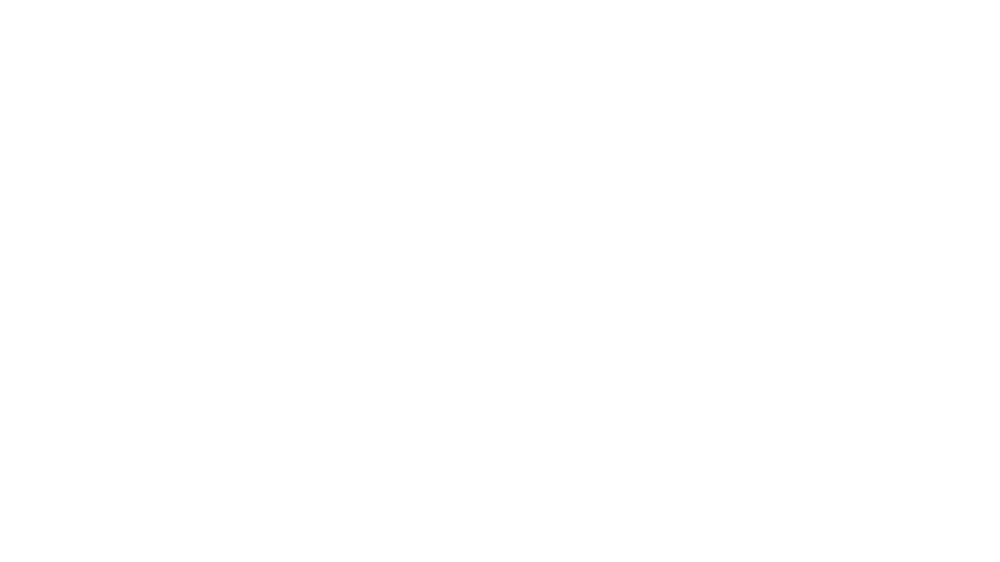

# ⏳ Temporal Memory Grid (TMG)

<p align="center">
  <a href="README.md">🇬🇧 English</a> •
  <a href="README.tr.md">🇹🇷 Türkçe</a>
</p>

---

<div align="center">

[](https://php.net/)
[](https://sqlite.org/)
[](https://docker.com/)
[](LICENSE)
[](tests/test_tmg.php)
[](https://github.com/adacreativeco/temporal-memory-grid/stargazers)

</div>

**Temporal Memory Grid (TMG)** is a high-performance temporal aggregation, time-series analysis, and anomaly detection engine. It continuously ingests high-frequency spatial and system events, derives multi-resolution time-buckets (`1m`, `5m`, `15m`, `1h`, `1d`), computes rolling percentile metrics, and evaluates threshold-based anomaly rules in real time.

<p align="center">
  
</p>

---

## 🌟 Visual Showcase & Key Modules



### 1. 📈 Time-Series Trends & Historical Rollups
- Multi-resolution aggregation over `1m`, `5m`, `15m`, `1h`, and `1d` intervals.
- Rolling percentiles (p50, p90, p95, p99), throughput curves, and latency distribution charts.

<p align="center">
  
</p>

### 2. 🚨 Anomaly Detection & Rule Thresholds
- Dynamic threshold monitoring for latency spikes, error rate escalations, and volume anomalies.
- Granular rule creation, severity classifications (Critical, Warning, Info), and active status toggles.

<p align="center">
  
</p>

### 3. 📋 Ingestion Logs & Aggregation History
- Comprehensive execution history for scheduled aggregation jobs and external puller workers.
- Execution duration tracking, processed record counts, and error telemetry.

<p align="center">
  
</p>

### 4. 🔑 API Governance & Interactive Documentation
- Complete REST API specification for querying temporal buckets, triggering manual rollups, and streaming telemetry.

<p align="center">
  
</p>

### 5. ⚙️ System Settings & Security
- Multi-user authentication, API key generation, caching policies, and timezone configurations.

<p align="center">
  
</p>

---

## 🚀 Quick Start

### 1. Requirements
- PHP 8.0+ (with `pdo`, `pdo_sqlite` or `pdo_mysql`)
- Web server (Nginx, Apache, or PHP Built-in Server)

### 2. Installation & Run
```bash
# Clone the repository
git clone https://github.com/adacreativeco/temporal-memory-grid.git
cd temporal-memory-grid

# Initialize the database
php setup_database_sqlite.php

# Start development server
php -S 127.0.0.1:8080
```

### 3. Run Automated Tests
```bash
php tests/test_tmg.php
```

---

## 📄 License
Licensed under the Apache License 2.0. Developed with 🧠 by [ADA Creative Co.](https://github.com/adacreativeco).
