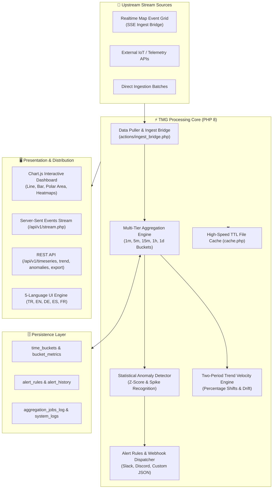

# ⏱️ Temporal Memory Grid (TMG)

<div align="center">

[](https://php.net/)
[](https://sqlite.org/)
[](https://tailwindcss.com/)
[-FF4500?style=for-the-badge)](https://developer.mozilla.org/en-US/docs/Web/API/Server-sent_events)
[-8A2BE2?style=for-the-badge)](lang/)
[](LICENSE)
[](tests/test_tmg.php)
[](https://github.com/adacreativeco/temporal-memory-grid/stargazers)
[](https://github.com/adacreativeco/temporal-memory-grid/releases)

<br/>

**High-Performance Time-Series Aggregation, Multi-Tier Temporal Bucketing & Statistical Anomaly Detection Engine.**

[English Documentation](README.md) • [🇹🇷 Türkçe Dokümantasyon](README.tr.md) • [📖 Case Study](https://adacreative.co/vaka-analizleri/temporal-memory-grid)

</div>

---

**Temporal Memory Grid (TMG)** is a lightweight, high-performance time-series event processing, temporal bucketing, trend analysis, and anomaly detection platform built with pure **PHP 8**, **SQLite/MySQL**, **TailwindCSS**, and **Chart.js**.

It connects to upstream spatial or real-time event streams (such as *Realtime Map Event Grid*), downsamples and aggregates high-frequency raw events into multi-tier time buckets (`1m`, `5m`, `15m`, `1h`, `1d`), detects statistical outliers and spikes, calculates two-period trend velocities, triggers webhook alerts, and streams metrics live via **Server-Sent Events (SSE)**.

---

## 🏗️ System Architecture



---

## 🚀 Key Features

### 1. ⏱️ Multi-Tier Temporal Bucketing
- Automatic downsampling and rollup into 5 standardized temporal resolutions: **`1m`**, **`5m`**, **`15m`**, **`1h`**, and **`1d`**.
- Computes aggregate metrics (total volume, category distributions, severity averages, min/max metrics) per time slice.

### 2. 🔍 Statistical Anomaly Detection
- Analyzes metric deviations using rolling baselines to detect volume spikes, traffic drops, and irregular activity.
- Exposes confidence scores and anomaly severity tags (`critical`, `warning`, `info`).

### 3. 📈 Two-Period Trend Analysis
- Compares metric performance across consecutive time windows (e.g. *Current 24h vs. Previous 24h* or *This Week vs. Last Week*).
- Outputs net percentage change, trend direction (`increasing`, `decreasing`, `stable`), and velocity indicators.

### 4. 🔔 Rule-Based Alerting & Outbound Webhooks
- Define custom trigger rules based on volume thresholds or anomaly detections.
- Native dispatch to **Slack**, **Discord**, or custom webhook endpoints with configurable cooldown intervals.

### 5. ⚡ Zero-Latency SSE Live Streaming
- Server-Sent Events push endpoint (`/api/v1/stream.php`) delivering new metric rollups and anomaly alerts to client dashboards in real time.

### 6. 🌐 5-Language Native Localization (i18n)
- Seamless multi-language support across all dashboards, tooltips, alert messages, and reports:
  * 🇹🇷 **Türkçe** • 🇬🇧 **English** • 🇩🇪 **Deutsch** • 🇪🇸 **Español** • 🇫🇷 **Français**

### 7. 🚀 Lightweight High-Speed Caching
- Built-in file-based TTL caching layer (`cache.php`) delivering sub-millisecond response times for heavy aggregations.

---

## 📡 REST API Reference

| Endpoint | Method | Authentication | Description |
|---|---|---|---|
| `/api/v1/timeseries.php` | `GET` | `X-API-Key` | Queries aggregated metric buckets with `bucket_size`, `start_time`, and `end_time` filters. |
| `/api/v1/trend.php` | `GET` | `X-API-Key` | Computes comparative trend velocity between two consecutive time periods. |
| `/api/v1/anomalies.php` | `GET` | `X-API-Key` | Lists detected statistical anomalies, severity levels, and baseline deviations. |
| `/api/v1/stream.php` | `GET` | Optional | Server-Sent Events (SSE) live metric stream. |
| `/api/v1/export.php` | `GET` | `X-API-Key` | Exports time-series datasets in JSON or CSV format for data science workflows. |

### 📝 Sample Timeseries Query (cURL)

```bash
curl -X GET "http://localhost:8080/api/v1/timeseries.php?bucket_size=1h&start_time=2026-08-01T00:00:00Z&end_time=2026-08-02T00:00:00Z" \
  -H "X-API-Key: temporal_grid_api_key_2024"
```

---

## 🛠️ Quick Start

### 1. Initialize Database & Seed Defaults
```bash
php setup_database_sqlite.php
```
*(Creates SQLite tables and seeds default `admin` / `temporal123` credentials).*

### 2. Run Automated Unit Tests
```bash
php tests/test_tmg.php
```

### 3. Start Local Server
```bash
php -S 0.0.0.0:8080
```
Open [http://localhost:8080](http://localhost:8080) in your browser.

### 4. Run Background Worker
```bash
# Continuous worker loop (or configure via systemd / cron)
php worker.php
```

---

## 📂 Project Structure

```
temporal-memory-grid/
├── config.php                      # Core configuration & cache directories
├── database_pdo.php                # PDO database singleton connector
├── setup_database_sqlite.php       # SQLite schema migrations & seeders
├── aggregation_engine.php          # Multi-tier temporal bucketing engine
├── alert_engine.php                # Alert evaluation & webhook dispatcher
├── cache.php                       # High-speed file caching manager
├── i18n.php                        # 5-Language internationalization engine
├── system_logs.php                 # System activity & error logging
├── utils.php                       # Time validation & format helpers
├── worker.php                      # Background aggregation & pull worker
├── index.php                       # Main dashboard (Chart.js charts & trends)
├── anomalies.php                   # Anomaly inspection view
├── trends.php                      # Comparative trend explorer
├── settings.php                    # System, retention & webhook settings
├── actions/                        # Background actions, API keys, and worker control
├── api/v1/                         # REST API endpoints (timeseries, trend, anomalies, stream)
├── docs/schemas/                   # Formal JSON schema validation files
├── lang/                           # Multi-language dictionaries (tr, en, de, es, fr)
├── tests/
│   └── test_tmg.php                # Automated test suite (22 unit tests)
└── scripts/
    ├── cron.sh                     # Linux cron trigger script
    └── run_worker.bat              # Windows background worker launcher
```

---

## 📄 License

Distributed under the Apache 2.0 License. See [LICENSE](LICENSE) for details.

---

<div align="center">
Built with ⏱️ by <a href="https://github.com/adacreativeco">ADA Creative Co.</a>
</div>
