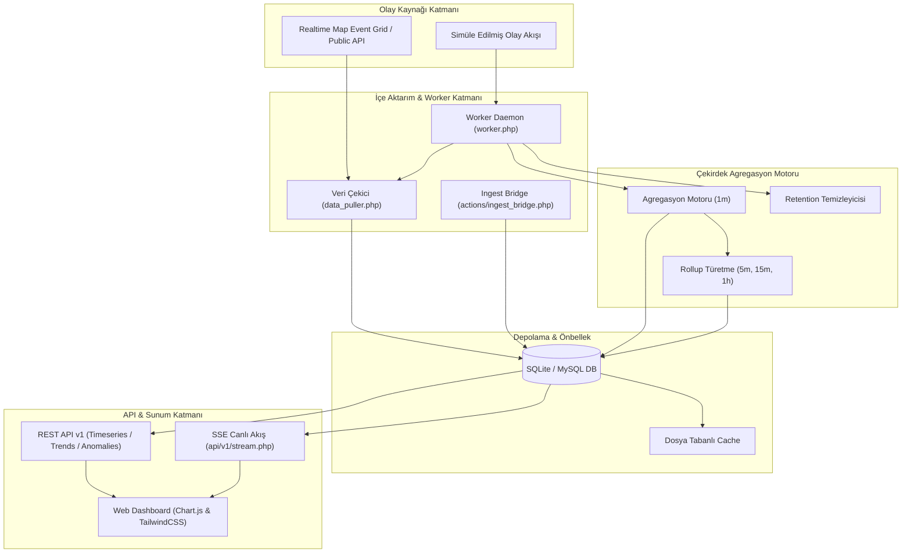

# Temporal Memory Grid (TMG)

<p align="center">
  <a href="README.md">🇬🇧 <b>English</b></a> |
  <a href="README.tr.md">🇹🇷 <b>Türkçe</b></a> |
  <a href="README.de.md">🇩🇪 <b>Deutsch</b></a> |
  <a href="README.es.md">🇪🇸 <b>Español</b></a> |
  <a href="README.fr.md">🇫🇷 <b>Français</b></a>
</p>

<p align="center">
  
  
  
  
  
  
</p>

**Temporal Memory Grid (TMG)**; PHP 8, SQLite/MySQL, TailwindCSS ve Chart.js ile geliştirilmiş, yüksek performanslı ve hafif bir zaman serisi olay toplama, zamansal kovalama (bucketing), agregasyon, trend karşılaştırma ve anomali tespit platformudur.

Canlı coğrafi veya veri akışlarına (örneğin *Realtime Map Event Grid*) kesintisiz bağlanır, yüksek frekanslı ham olayları çok katmanlı zaman kovalarına (`1m`, `5m`, `15m`, `1h`, `1d`) dönüştürür, anomalileri yakalar, iki dönemlik trendleri hesaplar ve etkileşimli grafiklerle gerçek zamanlı SSE veri akışı sunar.

---

## 📑 İçindekiler
- [Mimari](#-mimari)
- [Öne Çıkan Özellikler](#-öne-çıkan-özellikler)
- [Hızlı Başlangıç](#-hızlı-başlangıç)
- [Arka Plan Otomasyonu & Worker](#-arka-plan-otomasyonu--worker)
- [Gerçek Zamanlı Akış (SSE)](#-gerçek-zamanlı-akış-sse)
- [REST API Referansı](#-rest-api-referansı)
- [Dizin Yapısı](#-dizin-yapısı)
- [Güvenlik & Yetkilendirme](#-güvenlik--yetkilendirme)
- [Lisans & Yazarlar](#-lisans--yazarlar)

---

## 🏛 Mimari



---

## ✨ Öne Çıkan Özellikler

1. **Zamansal Kovalama & Agregasyon Motoru**
   - Ham olayları otomatik olarak `1m`, `5m`, `15m`, `1h`, `1d` aralıklarına böler.
   - Metrikler: `total_events`, `events_by_type`, `events_by_source` ve `events_by_geo_region`.
   - Analitik sorgular için üst seviye rollupları otomatik üretir.

2. **Etkileşimli Zaman Serisi Paneli (Dashboard)**
   - Chart.js tabanlı çizgi ve sütun grafikleri.
   - Tarih filtreleri (Bugün, Son 24 Saat, Son 7 Gün, Özel aralık), kova boyutu, olay türü ve kaynak filtreleme.
   - Toplam olay, en yoğun kova ve ortalama oranları gösteren özet KPI kartları.

3. **İki Dönemlik Trend Karşılaştırma**
   - Birinci dönemi karşılaştırma dönemiyle kıyaslama (örn: Bu saat vs Geçen saat).
   - Mutlak fark ve yüzde değişim hesaplamaları ile karşılaştırmalı grafikler.

4. **Anomali Tespiti**
   - **Tarihsel Ortalama** veya **Hareketli Ortalama (MA)** referansıyla olağandışı sıçrama ve düşüşleri tespit eder.
   - Anomaliye uğrayan kovaları grafikte kırmızı ile vurgular ve tablo olarak listeler.

5. **Otomatik Arka Plan İşleyicisi (Worker / Daemon)**
   - Bağımsız CLI daemon'u (kalp atışı takibi, `--interval=10`) veya crontab modu (`--once`).
   - Otomatik veri çekme, rollup türetme ve günlük retention temizliği.

6. **Gerçek Zamanlı Canlı Akış (SSE - Server-Sent Events)**
   - Dahili `api/v1/stream.php` servisi ile sayfayı yenilemeden anlık kova verilerini canlı grafiklere aktarma.

7. **Dinamik Veritabanı Yetkilendirmesi & API Key Yönetimi**
   - Bcrypt şifre hashleme (`password_verify`).
   - Panelden dinamik API Key üretme, durdurma, rate limit belirleme ve panoya kopyalama.

8. **Kurumsal Çok Dilli Destek (i18n)**
   - 5 yerleşik dil: 🇹🇷 Türkçe, 🇬🇧 İngilizce, 🇩🇪 Almanca, 🇪🇸 İspanyolca, 🇫🇷 Fransızca.
   - Otomatik tarayıcı dili algılama (`Accept-Language` ağırlık puanlaması).
   - Dil değişiminde URL filtrelerini koruma ve Chart.js eksenlerini yerelleştirme.

---

## 🚀 Hızlı Başlangıç

### 1. Gereksinimler
- **PHP 8.0+** (`pdo_sqlite` veya `pdo_mysql`, `curl`, `json` eklentileri aktif).
- Web Sunucu: Yerleşik PHP sunucusu, Apache veya Nginx.

### 2. Veritabanı Kurulumu & Başlatma
Otomatik SQLite şema ve seed betiğini çalıştırın:
```bash
php setup_database_sqlite.php
```
*Tüm tabloları (`users`, `api_keys`, `time_buckets`, `bucket_metrics`, `events`, `settings`) oluşturur ve varsayılan yönetici ile API anahtarlarını tanımlar.*

### 3. Web Sunucusunu Başlatın
```bash
php -S localhost:8000
```

### 4. Yönetim Paneline Erişin
- **URL:** `http://localhost:8000/login.php`
- **Kullanıcı Adı:** `admin`
- **Şifre:** `temporal123`

---

## ⚙️ Arka Plan Otomasyonu & Worker

Worker arka planda harici akışlardan verileri çeker, kovalara böler ve veri saklama kurallarına göre eski kayıtları temizler.

### Sürekli Daemon Modu:
```bash
php worker.php --interval=10 --simulate
```
*Windows'ta çift tıklayarak çalıştırmak için: [`scripts/run_worker.bat`](file:///g:/shovt/tam%20olarak%20bitmeyenler/TEMPORAL%20MEMORY%20GRID/TEMPORAL%20MEMORY%20GRID/scripts/run_worker.bat).*

### Tek Seferlik / Crontab Modu:
```bash
php worker.php --once --simulate
```
Linux crontab eklemek için (`crontab -e`):
```bash
* * * * * /usr/bin/php /path/to/project/worker.php --once >> /var/log/tmg_worker.log 2>&1
```

---

## 📡 Gerçek Zamanlı Akış (SSE)

JavaScript ile canlı Server-Sent Events akışına bağlanın:

```javascript
const eventSource = new EventSource('/api/v1/stream.php?api_key=temporal_grid_api_key_2024&bucket_size=1m');

eventSource.addEventListener('update', (event) => {
    const data = JSON.parse(event.data);
    console.log('Canlı Kova Verisi:', data);
});
```

---

## 🔌 REST API Referansı

Tüm API istekleri `?api_key=...` query parametresi veya `X-API-Key: ...` HTTP Header'ı gerektirir.

### Varsayılan API Anahtarları:
- `temporal_grid_api_key_2024`
- `demo_key_12345`

| Uç Nokta | Metot | Açıklama |
| :--- | :---: | :--- |
| `/api/v1/timeseries.php` | `GET` | Belirtilen metrik ve zaman aralığı için zaman serisi kovalarını döndürür. |
| `/api/v1/trend.php` | `GET` | İki zaman penceresini karşılaştırarak oran farkını hesaplar. |
| `/api/v1/anomalies.php` | `GET` | Tarihsel veya hareketli ortalamaya göre sapma gösteren anomalileri bulur. |
| `/api/v1/stream.php` | `GET` | Gerçek zamanlı grafikler için Server-Sent Events (SSE) akışı sağlar. |
| `/api/v1/export.php` | `GET` | Verileri CSV veya JSON olarak dışa aktarır. |

#### Örnek Zaman Serisi Çağrısı:
```bash
curl -X GET "http://localhost:8000/api/v1/timeseries.php?api_key=temporal_grid_api_key_2024&metric_type=total_events&bucket_size=1m&start_time=2026-08-22T00:00:00Z&end_time=2026-08-22T12:00:00Z"
```

---

## 📁 Dizin Yapısı

```
TEMPORAL MEMORY GRID/
├── actions/                     # AJAX ve Backend API uçları
│   ├── api_keys.php             # API Key yönetimi (CRUD)
│   ├── change_password.php      # Şifre güncelleme
│   ├── set_language.php         # Dil değiştirme AJAX ucu
│   ├── ingest_bridge.php        # JSON köprüsü & tekilleştirme
│   ├── worker_status.php        # Worker sağlık & heartbeat API'si
│   └── worker_control.php       # Manuel worker döngüsü tetikleyici
├── api/v1/                      # REST API Servisleri
│   ├── timeseries.php           # Zaman serisi kova verileri
│   ├── trend.php                # İki dönemlik karşılaştırma
│   ├── anomalies.php            # Anomali tespit servisi
│   ├── stream.php               # Server-Sent Events (SSE)
│   └── export.php               # CSV/JSON export
├── docs/                        # Dokümantasyon ve JSON şemaları
├── includes/                    # Header, Footer ve genel bileşenler
├── lang/                        # Çok dilli sözlükler (TR, EN, DE, ES, FR)
├── postman/                     # Hazır Postman koleksiyonu
├── scripts/                     # Windows (.bat) ve Linux (.sh) çalıştırıcıları
├── aggregation_engine.php       # Çekirdek agregasyon ve kovalama motoru
├── auth.php                     # Güvenlik & API anahtarı doğrulama
├── cache.php                    # Dosya tabanlı önbellek servisi
├── config.php                   # Sistem yapılandırması
├── config.sample.php            # Örnek yapılandırma şablonu
├── data_puller.php              # Harici veri çekici
├── derive_rollups.php           # Rollup türetme (1m -> 5m -> 15m -> 1h)
├── i18n.php                     # Çok dilli dil motoru ve otomatik algılama
├── index.php                    # Dashboard Arayüzü
├── trends.php                   # Trend Karşılaştırma Arayüzü
├── anomalies.php                # Anomali Tespiti Arayüzü
├── settings.php                 # Ayarlar, Worker ve API Key Arayüzü
├── worker.php                   # Arka Plan Worker Daemon'u
└── setup_database_sqlite.php    # Veritabanı şema ve seed betiği
```

---

## 🔒 Güvenlik & Yetkilendirme

- **Web Paneli:** Bcrypt şifre hashleme (`PASSWORD_BCRYPT`) ile oturum tabanlı kimlik doğrulama.
- **REST API:** `api_keys` tablosu üzerinden IP/dakika bazlı hız sınırlaması (varsayılan: 100 istek/dk).
- **SQL Enjeksiyonu Koruması:** PDO üzerinden %100 parametreli sorgular.
- **XSS Koruması:** Tüm arayüzlerde `htmlspecialchars` ile veri filtreleme.

---

## 📄 Lisans & Yazarlar

- **Yazar & Bakımcı:** **ADA Creative Co.** ([https://adacreative.co](https://adacreative.co))
- **İletişim / Git:** [git@adacreative.co](mailto:git@adacreative.co)
- **Lisans:** Bu proje [Apache License 2.0](LICENSE) ile lisanslanmıştır.
