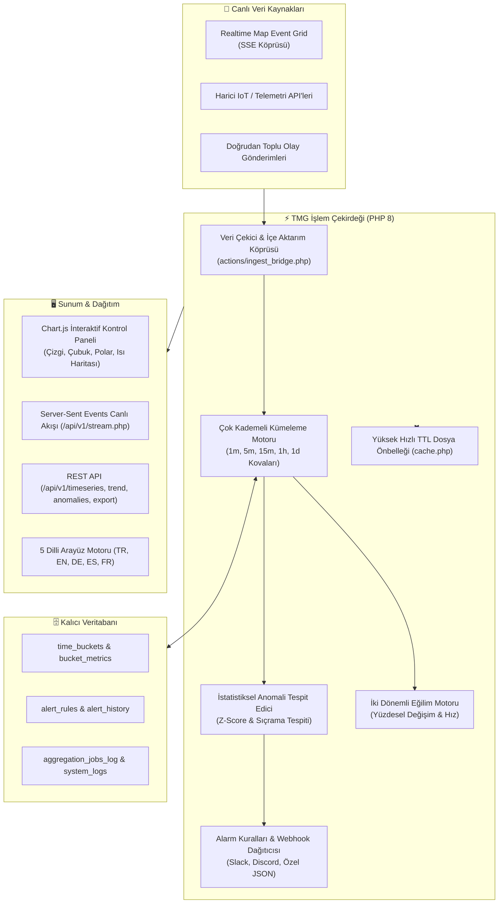

# ⏱️ Temporal Memory Grid (TMG)

<div align="center">

[](https://php.net/)
[](https://sqlite.org/)
[](https://tailwindcss.com/)
[-FF4500?style=for-the-badge)](https://developer.mozilla.org/en-US/docs/Web/API/Server-sent_events)
[-8A2BE2?style=for-the-badge)](lang/)
[](LICENSE)
[](tests/test_tmg.php)
[](https://github.com/adacreativeco/temporal-memory-grid/stargazers)
[](https://github.com/adacreativeco/temporal-memory-grid/releases)

<br/>

**Yüksek Performanslı Zaman Serisi Kümeleme, Çok Kademeli Zaman Kovalama & İstatiksel Anomali Tespit Motoru.**

[🇹🇷 Türkçe Dokümantasyon](README.tr.md) • [🇺🇸 English Documentation](README.md) • [📖 Vaka Analizi](https://adacreative.co/vaka-analizleri/temporal-memory-grid)

</div>

---

**Temporal Memory Grid (TMG)**, saf **PHP 8**, **SQLite/MySQL**, **TailwindCSS** ve **Chart.js** kullanılarak geliştirilmiş, hafif ve yüksek performanslı bir zaman serisi veri işleme, zamansal kovalama (bucketing), eğilim (trend) analizi ve anomali tespit platformudur.

Harici mekansal ya da gerçek zamanlı olay akışlarına (örneğin *Realtime Map Event Grid*) bağlanır, yüksek frekanslı ham olayları çok kademeli zaman kovalarına (**`1m`**, **`5m`**, **`15m`**, **`1h`**, **`1d`**) indirger ve özetler; istatistiksel sapmaları ve ani sıçramaları tespit eder, iki dönemli eğilim hızlarını hesaplar, webhook uyarıları fırlatır ve metrikleri **Server-Sent Events (SSE)** üzerinden canlı yayınlar.

---

## 🏗️ Sistem Mimarisi



---

## 🚀 Öne Çıkan Yetenekler

### 1. ⏱️ Çok Kademeli Zamansal Kovalama (Bucketing)
- Ham olayları 5 standart zaman çözünürlüğünde otomatik indirger ve kümeleştirir: **`1m`**, **`5m`**, **`15m`**, **`1h`** ve **`1d`**.
- Her zaman dilimi için toplam hacmi, kategori dağılımlarını, ortalama önem derecelerini ve min/max değerlerini hesaplar.

### 2. 🔍 İstatistiksel Anomali Tespiti
- Metrik sapmalarını hareketli taban çizgileriyle (rolling baseline) karşılaştırarak hacim sıçramalarını, ani trafik düşüşlerini ve olağandışı aktiviteleri tespit eder.
- Güven skorları ve anomali ciddiyet etiketleri (`critical`, `warning`, `info`) üretir.

### 3. 📈 İki Dönemli Eğilim (Trend) Analizi
- İki ardışık zaman penceresindeki (ör. *Son 24 Saat vs. Önceki 24 Saat*) metrik performansını karşılaştırır.
- Net yüzdesel değişim, eğilim yönü (`artan`, `azalan`, `durağan`) ve ivme göstergeleri sunar.

### 4. 🔔 Kural Tabanlı Alarmlar & Dışa Aktarım Webhookları
- Hacim eşiklerine veya anomali tespitlerine göre özel tetikleme kuralları tanımlama.
- **Slack**, **Discord** veya özel webhook uç noktalarına otomatik uyarı bildirimi.

### 5. ⚡ Sıfır Gecikmeli Canlı SSE Akışı
- Server-Sent Events uç noktası (`/api/v1/stream.php`) üzerinden kontrol paneline milisaniyeler içinde yeni özetleri ve anomali alarmlarını iletir.

### 6. 🌐 5 Dilli Yerel Destek (i18n)
- Kontrol paneli, grafikler, modallar ve uyarı mesajlarında tam dil desteği:
  * 🇹🇷 **Türkçe** • 🇬🇧 **English** • 🇩🇪 **Deutsch** • 🇪🇸 **Español** • 🇫🇷 **Français**

### 7. 🚀 Yüksek Hızlı TTL Önbellek
- Dahili dosya önbellekleme mekanizması (`cache.php`) ile ağır kümeleme sorgularında anlık yanıt süreleri.

---

## 📡 REST API Referansı

| Uç Nokta | Metot | Kimlik Doğrulama | Açıklama |
|---|---|---|---|
| `/api/v1/timeseries.php` | `GET` | `X-API-Key` | `bucket_size`, `start_time` ve `end_time` filtreleriyle zaman serisi metrik kovalarını sorgular. |
| `/api/v1/trend.php` | `GET` | `X-API-Key` | İki ardışık zaman periyodu arasındaki karşılaştırmalı eğilim hızını hesaplar. |
| `/api/v1/anomalies.php` | `GET` | `X-API-Key` | Tespit edilen istatistiksel anomalileri ve taban çizgisi sapmalarını listeler. |
| `/api/v1/stream.php` | `GET` | İsteğe Bağlı | Server-Sent Events (SSE) canlı metrik akışı. |
| `/api/v1/export.php` | `GET` | `X-API-Key` | Zaman serisi verilerini JSON veya CSV olarak dışa aktarır. |

### 📝 Örnek Zaman Serisi Sorgusu (cURL)

```bash
curl -X GET "http://localhost:8080/api/v1/timeseries.php?bucket_size=1h&start_time=2026-08-01T00:00:00Z&end_time=2026-08-02T00:00:00Z" \
  -H "X-API-Key: temporal_grid_api_key_2024"
```

---

## 🛠️ Hızlı Başlangıç

### 1. Veritabanını Başlatın ve Örnek Verileri Yükleyin
```bash
php setup_database_sqlite.php
```
*(SQLite tablolarını oluşturur ve varsayılan `admin` / `temporal123` kullanıcısını ekler).*

### 2. Otomatik Birim Testleri Çalıştırın
```bash
php tests/test_tmg.php
```

### 3. Yerel Sunucuyu Başlatın
```bash
php -S 0.0.0.0:8080
```
Tarayıcınızda [http://localhost:8080](http://localhost:8080) adresini açın.

### 4. Arka Plan İşçisini (Worker) Başlatın
```bash
php worker.php
```

---

## 📂 Proje Yapısı

```
temporal-memory-grid/
├── config.php                      # Ana yapılandırma ve önbellek yolları
├── database_pdo.php                # PDO veritabanı bağlantı havuzu
├── setup_database_sqlite.php       # SQLite şema göçleri ve veri tohumlayıcı
├── aggregation_engine.php          # Çok kademeli zamansal kümeleme motoru
├── alert_engine.php                # Alarm değerlendirme ve webhook dağıtıcısı
├── cache.php                       # Yüksek hızlı dosya önbellek yöneticisi
├── i18n.php                        # 5 dilli uluslararasılaşma motoru
├── system_logs.php                 # Sistem olay ve hata kayıtları
├── utils.php                       # Zaman doğrulama ve biçimlendirme araçları
├── worker.php                      # Arka plan kümeleme ve veri çekme işçisi
├── index.php                       # Ana kontrol paneli (Chart.js grafikleri)
├── anomalies.php                   # Anomali inceleme ekranı
├── trends.php                      # Karşılaştırmalı eğilim gezgini
├── settings.php                    # Sistem, saklama süresi ve webhook ayarları
├── actions/                        # Arka plan eylemleri ve API anahtar yönetimi
├── api/v1/                         # REST API uç noktaları (timeseries, trend, anomalies, stream)
├── docs/schemas/                   # JSON şema doğrulama dosyaları
├── lang/                           # 5 dilli sözlük dosyaları (tr, en, de, es, fr)
├── tests/
│   └── test_tmg.php                # Otomatik test paketi (22 birim test)
└── scripts/
    ├── cron.sh                     # Linux cron çalıştırma betiği
    └── run_worker.bat              # Windows arka plan işçi başlatıcısı
```

---

## 📄 Lisans

Apache 2.0 Lisansı ile dağıtılmaktadır. Detaylar için [LICENSE](LICENSE) dosyasına bakabilirsiniz.

---

<div align="center">
⏱️ <a href="https://github.com/adacreativeco">ADA Creative Co.</a> tarafından geliştirilmiştir.
</div>
