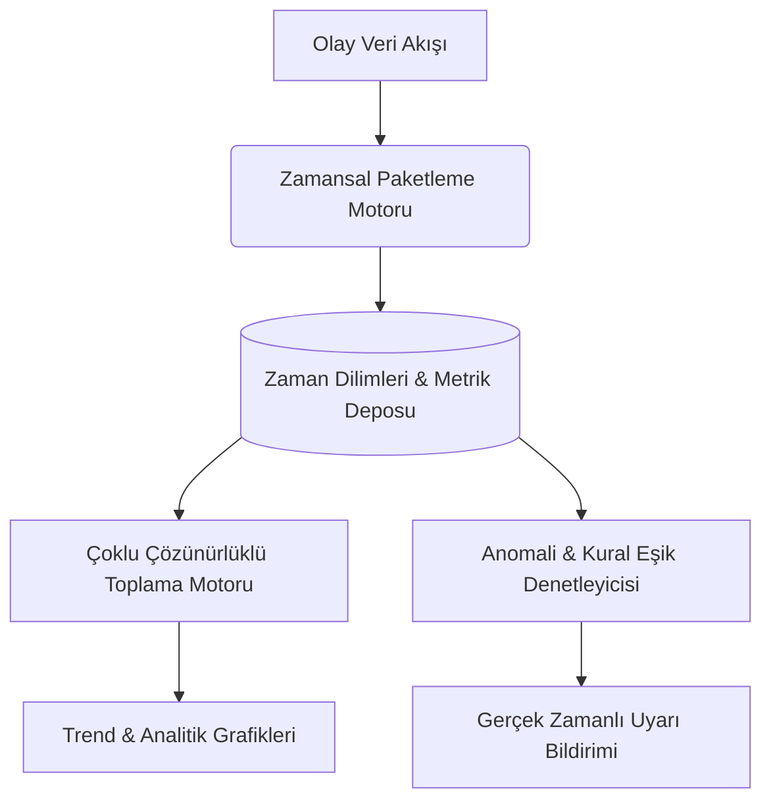

# ⏳ Temporal Memory Grid (TMG)

<p align="center">
  <a href="README.md">🇬🇧 English</a> •
  <a href="README.tr.md">🇹🇷 Türkçe</a>
</p>

---

<div align="center">

[](https://php.net/)
[](https://sqlite.org/)
[](https://docker.com/)
[](LICENSE)
[](tests/test_tmg.php)
[](https://github.com/adacreativeco/temporal-memory-grid/stargazers)

</div>

**Temporal Memory Grid (TMG)**, yüksek frekanslı zaman serisi verilerini toplayan, farklı zaman pencerelerinde (`1m`, `5m`, `15m`, `1h`, `1d`) toplayıp özetleyen ve anomali tespiti yapan yüksek performanslı bir zamansal veri motorudur.

<p align="center">
  
</p>

---

## 🌟 Öne Çıkan Modüller & Görseller



### 1. 📈 Zamansal Trendler & Tarihsel Özetler
* `1m`, `5m`, `15m`, `1h`, `1d` pencerelerinde metrik hesaplama.
* Yüzdelik dilimler (p50, p90, p95, p99), verim eğrileri ve gecikme dağılım grafikleri.

<p align="center">
  
</p>

### 2. 🚨 Anomali Tespiti & Eşik Kuralları
* Gecikme artışları, hata oranı sıçramaları ve hacim anomalilerini anlık izleme.
* Kural oluşturma, önem derecelendirmesi (Kritik, Uyarı, Bilgi) ve aktif/pasif kontrolleri.

<p align="center">
  
</p>

### 3. 📋 Sistem Logları & İşlem Geçmişi
* Zamanlanmış toplama (rollup) işlerinin ve dış veri çekici süreçlerin detaylı yürütme geçmişi.
* İşlem süreleri, işlenen kayıt sayısı ve hata telemetrisi.

<p align="center">
  
</p>

### 4. 🔑 İnteraktif API Dokümantasyonu
* Zamansal paketleri sorgulamak, manuel özetlemeleri tetiklemek ve telemetri aktarmak için REST API kılavuzu.

<p align="center">
  
</p>

### 5. ⚙️ Sistem Ayarları & Güvenlik
* Kullanıcı yönetimi, API anahtarı üretimi, önbellekleme ve saat dilimi yapılandırmaları.

<p align="center">
  
</p>

---

## 🚀 Hızlı Başlangıç

### 1. Gereksinimler
* PHP 8.0+ (`pdo`, `pdo_sqlite` veya `pdo_mysql` eklentileri)
* Web sunucusu (Nginx, Apache veya PHP Yerel Sunucusu)

### 2. Kurulum ve Çalıştırma
```bash
# Depoyu klonlayın
git clone https://github.com/adacreativeco/temporal-memory-grid.git
cd temporal-memory-grid

# Veritabanını başlatın
php setup_database_sqlite.php

# Geliştirme sunucusunu başlatın
php -S 127.0.0.1:8080
```

### 3. Otomatik Testleri Çalıştırma
```bash
php tests/test_tmg.php
```

---

## 📄 Lisans
Apache License 2.0 ile lisanslanmıştır. [ADA Creative Co.](https://github.com/adacreativeco) tarafından geliştirilmiştir.
